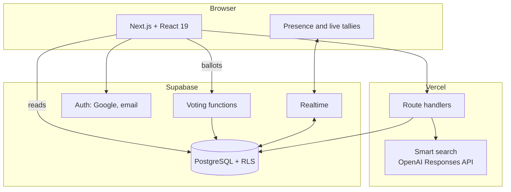

<div align="center">

# Planind

Real-time group decision-making for plans in Dubai: shortlist, vote in rounds, then coordinate the outing.

[Live app](https://plan-ind.vercel.app) · [Demo (no account required)](https://plan-ind.vercel.app/demo)

[](https://github.com/aryansajiv19/plan-ind/actions/workflows/ci.yml)


</div>

https://github.com/user-attachments/assets/b4d43a6f-cfd2-4ab5-9c11-1d6dfedcd3f4

## Overview

Planind addresses the stage of group planning before any decision exists. A host sets constraints (budget, travel distance and type of outing), the application deals nine candidate venues from a curated Dubai catalogue with a stated reason for each, and participants vote live through three elimination rounds and a final. The plan then continues into RSVPs, carpools, calendar invites, directions, weather and post-visit ratings.

Voting integrity is enforced in PostgreSQL: clients never write votes directly, every ballot passes through a database function, and concurrency, authorization and idempotency are covered by tests that run against a real database.

## Contents

- [Features](#features)
- [Architecture](#architecture)
- [Engineering highlights](#engineering-highlights)
- [Performance](#performance)
- [Testing](#testing)
- [Getting started](#getting-started)
- [Project structure](#project-structure)
- [Documentation](#documentation)

## Features

- **Constraint-based shortlisting.** Nine venues dealt into three rounds of three, filtered by budget, distance and outing type, each with the reason it was selected.
- **Live elimination voting.** Rounds and a final with presence, live tallies and animated ballot placement over Supabase Realtime.
- **Natural-language search.** An LLM maps free-text requests to structured search intent, validated server-side before use.
- **Post-decision coordination.** RSVPs, carpools, calendar invites, directions, weather and ratings.
- **Dubai-local behaviour.** All times, opening hours and time-of-day styling follow Dubai time regardless of the viewer's time zone.
- **Private by default.** Plans are readable only by members; shared links expose a minimal read-only preview.

<p align="center"></p>

<table>
  <tr>
    <td></td>
    <td></td>
    <td></td>
  </tr>
  <tr>
    <td align="center">Shortlist</td>
    <td align="center">Live voting</td>
    <td align="center">Result</td>
  </tr>
</table>

## Architecture



| Layer | Technology |
|---|---|
| Client | Next.js 16 (App Router), React 19, TypeScript, Tailwind CSS 4 |
| Server | Next.js route handlers on Vercel |
| Database | Supabase PostgreSQL with row-level security, database functions for all voting, `pg_trgm` search indexes |
| Realtime | Supabase Realtime for presence and vote updates |
| Auth | Supabase Auth (Google OAuth, email) |
| AI | OpenAI Responses API with JSON Schema structured output |
| Testing | Node test runner, database integration tests, Playwright, load scripts |

## Engineering highlights

**Server-enforced voting.** Ballots are cast only through database functions that verify the round is open, the caller is a plan member and no ballot already exists. Concurrent submissions from the same participant resolve to exactly one row, verified by dedicated race-condition tests.

**One account, one vote.** Guest voting was removed after it was shown that a private browsing window allowed a second ballot. Voting now requires authentication.

**Structured AI output behind a trust boundary.** Smart search uses the OpenAI Responses API with a JSON Schema output format. Every decision made after the model responds is a pure function, so a hermetic test suite drives it with hostile and malformed model outputs without network access or an API key. A separate scored evaluation (`npm run eval:ai`) runs against the live model on demand.

**SSRF-hardened fetching.** Venue import from user-supplied URLs uses a fetch primitive that checks every resolved address against private and reserved ranges and pins the connection to the checked address, closing DNS-rebinding attacks. Response bodies are capped across chunk boundaries.

**ReDoS mitigation.** Pasting a long link previously stalled the server in a regular expression. Parsing now terminates in under 50 ms, enforced by a regression test.

**Link previews without data leakage.** Shared links render a minimal read-only summary for messaging-app previews; plan contents remain restricted to members by RLS.

## Performance

| Measurement | Before | After |
|---|---:|---:|
| Venue search with no match, 5,082 venues | 2.256 ms (sequential scan) | **0.074 ms** (trigram GIN index), 30× |
| Venue search, rare term | 2.302 ms | **0.109 ms**, 21× |
| 200 simultaneous voters (local stack) | | All ballots under 250 ms, no errors |
| Database time per vote | | About 0.5 ms |

Methodology is recorded alongside the change in [`supabase/migration-040-scale-indexes-and-rsvp-guard.sql`](supabase/migration-040-scale-indexes-and-rsvp-guard.sql) and the load scripts in [`scripts/load/`](scripts/load). Beyond 200 concurrent voters the local API gateway exhausted its connections before the database did; 1,000 votes sent directly to the database all succeeded. The same indexing work uncovered and fixed results being silently capped at 1,000 rows.

Benchmarks compare builds run side by side: an initial sequential comparison reported a 40% improvement that measured 8.5% once server warm-up was controlled for.

## Testing

| Suite | Scope | Command |
|---|---|---|
| Unit | 380+ tests: dealing, tallying and ties, opening hours, parsing, AI guardrails, SSRF guard | `npm test` |
| Database | 170+ tests against real PostgreSQL: vote idempotency and races, membership and permissions, plan lifecycle | `npm run test:db` |
| End-to-end | Playwright on desktop Chrome, Safari and Firefox, and mobile Safari and Chrome | `npm run test:e2e` |
| AI evaluation | Scored evaluation of smart search against the live model (opt-in) | `npm run eval:ai` |
| Load | Vote bursts and Realtime fan-out | [`scripts/load/`](scripts/load) |

CI runs linting, type checking, the database tests and a production build on every push.

## Getting started

### Prerequisites

- Node.js 22 or later
- A Supabase project, or the Supabase CLI and Docker for a local stack

### Installation

```bash
npm ci
cp .env.local.example .env.local    # Supabase URL and publishable key
npm run dev
```

For a local database, run `supabase start` and load [`supabase/schema.sql`](supabase/schema.sql). The schema script drops and recreates every table, so use it only against a disposable project. Setup for the database and browser suites is documented in [`tests/README.md`](tests/README.md).

## Project structure

| Path | Contents |
|---|---|
| [`app/`](app) | Pages and route handlers |
| [`components/`](components) | UI components |
| [`lib/`](lib) | Domain logic: dealing, tallying, opening hours, AI intent, place import, security, search |
| [`supabase/`](supabase) | Schema and ordered migrations |
| [`tests/`](tests) | Unit, database and end-to-end tests |
| [`scripts/`](scripts) | Load testing, AI evaluation, data backfill |
| [`docs/`](docs) | Product flow, design standards, security and deployment |

## Documentation

- [Product flow](docs/PRODUCT_FLOW.md)
- [Frontend design standards](docs/FRONTEND_DESIGN_STANDARDS.md)
- [Security setup](docs/SECURITY_SETUP.md)
- [Deployment](docs/DEPLOYMENT.md)
- [Roadmap](docs/ROADMAP.md)

<div align="center">

Built by [Aryan Sajiv](https://github.com/aryansajiv19)

</div>
