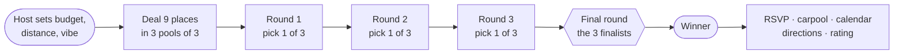
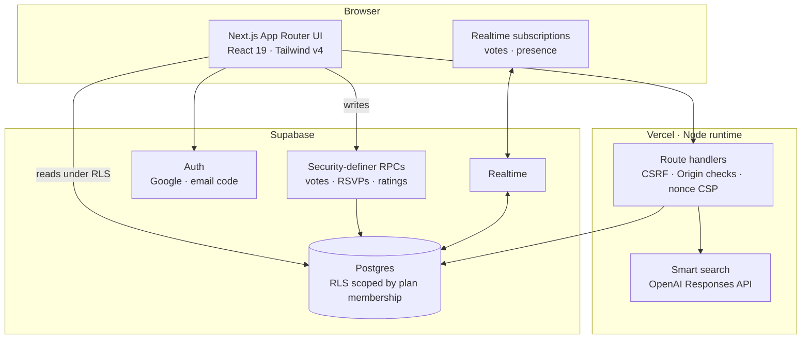

<div align="center">

# plan-ind

**Dubai plans, without the group chat.**

Nine places. Three rounds. One plan everyone actually agreed to.

[**Live app**](https://plan-ind.vercel.app) · [**Try the demo — no account**](https://plan-ind.vercel.app/demo) · [How it works](#how-it-works) · [Engineering](#engineering-decisions)

[](https://github.com/aryansajiv19/plan-ind/actions/workflows/ci.yml)


</div>

---

## The problem

Every weekend plan starts the same way: someone says *"we should do something"*,
forty messages later there are six suggestions, three people who haven't
replied, and no booking. Planning apps get good **after** someone already knows
the plan. plan-ind owns the messy moment before that.

## What it does

1. **One person hosts.** They set the budget, how far people will drive, the
   vibe, and the kind of night (dinner, brunch, desert, padel…).
2. **The app deals nine places** from a curated Dubai catalogue — filtered by
   budget, distance, age suitability and places the group has already been —
   and says *why* each one made the cut.
3. **Friends vote from a link.** No install. Three rounds of three, each sends
   one finalist forward; a final round picks the winner. Votes and faces move
   live for everyone in the room.
4. **The plan carries through.** RSVPs, who's driving and who needs a ride,
   calendar export, directions, weather for the night, and ratings afterwards.

<!-- Screenshots land here: docs/media/ -->

## How it works





## Engineering decisions

Measured, not guessed. Every number below comes from a harness in this repo
(`scripts/load/`, `tests/`), with its method recorded next to it.

| Decision | Why | Result |
|---|---|---|
| **Every vote, RSVP and rating goes through a security-definer RPC** — no direct write policy exists on those tables | A client can't forge a ballot, vote in a round that has closed, or vote twice | Two parallel `cast_plan_vote` calls from separate Postgres backends leave exactly **1 row**; 15 simultaneous same-name RSVPs → **1 winner, 14 clean rejections**, no raw Postgres error |
| **Reads scoped by plan membership** (`plan_access`), not "anyone with the link" | Share links travel through WhatsApp; the row data shouldn't | Link previews use a separate function that returns only non-sensitive fields |
| **Idempotent votes** on a unique per-user round key | Double-taps and retries on flaky mobile networks | A repeated vote is a no-op, a changed vote is an update |
| **Trigram indexes** on the catalogue search | Fuzzy place search at catalogue scale | At 5,082 spots: a search miss went from **2.26 ms → 0.07 ms (30×)**; the same pass found and fixed a silent PostgREST 1,000-row cap |
| **Parallelised auth + quota check** on the deal route | Two independent round trips were sequential | p50 **61.6 → 56.3 ms**; the new build won **12/12** paired reps (both builds run at once, alternating). An earlier sequential run claimed 40% — that was server warm-up, and it's documented as such |
| **Bounded link parsing** for pasted Instagram/TikTok/web links | One regex could hang the whole Node process | A 536 KB input that never returned now finishes in **< 50 ms** (regression-tested) |
| **Postgres-backed quotas** per user and globally | Stops abuse of AI search and place photos without adding Redis | Enforced in the database, so every server instance shares one limit |
| **Knowing the ceiling** | Load tests are only useful if they find where things break | Vote RPC burst on one machine: **200 concurrent at p99 262 ms, 0 errors**; errors begin at 250. A production build serves **857 req/s at p99 30 ms** locally |

## Design

The interface is built to feel like going out, not filling in a form:

- **Faces, not counters.** A vote flies the voter's face from the room onto the
  card they picked (FLIP with the Web Animations API — the element is always
  laid out at its real position, so a backgrounded tab can never strand one
  mid-flight).
- **The clock is Dubai's.** Opening hours, "closing soon" and the day/night
  treatment follow the venue's timezone, wherever the viewer is.
- **Colour has jobs.** Five category groups, a champagne tone reserved for the
  outcome, and nothing else gets a hue — the rules are written down in
  [`docs/FRONTEND_DESIGN_STANDARDS.md`](docs/FRONTEND_DESIGN_STANDARDS.md).
- **Accessible by default.** 44 px targets, visible focus rings, reduced-motion
  respected, and state is never carried by colour alone.

## Security model

- **Identity is a real account.** Everyone who joins or votes signs in (Google
  or an email code). Age comes from a server-owned table, never from a request.
- **Row-level security everywhere**, scoped to plan membership; secrets such as
  host tokens live in tables with no read policy at all.
- **Nonce-based CSP** with `strict-dynamic`, CSRF double-submit plus Origin
  checks, SSRF guards (private-IP and redirect checks) on link import.
- **Model output is treated as untrusted input**: strict structured output,
  re-validated on the server, and it never reaches a query filter unchecked.

## Testing

| Layer | What | Command |
|---|---|---|
| Unit | Tally, tie-breaks, dealing, parsing, security helpers — hermetic | `npm test` |
| Database | Real Postgres: races, idempotency, grants, RLS | `npm run test:db` |
| End-to-end | Playwright, desktop Chromium + mobile, against a local Supabase stack | `npm run test:e2e` |
| Load | Vote bursts, Realtime fan-out, route latency | `scripts/load/` |

CI runs lint, typecheck, a schema-to-types drift check, `npm audit`, the build
and the database suite on every push.

## Stack

**Next.js 16** (App Router, React 19) · **Tailwind CSS v4** · **Supabase**
(Postgres, Auth, Realtime, Storage) · **OpenAI Responses API** · **Vercel** ·
**Playwright** · TypeScript throughout.

## Run it locally

```bash
npm ci
cp .env.local.example .env.local   # a Supabase project URL + publishable key
npm run dev                        # http://localhost:3000
```

For a throwaway database, run `supabase start` and apply `supabase/schema.sql`.
It drops and recreates every table, so never point it at a real project.
Full recipe for the database and E2E suites: [`tests/README.md`](tests/README.md).

## Repository map

| Path | What |
|---|---|
| [`app/`](app) | Routes and API handlers |
| [`components/`](components) | UI |
| [`lib/`](lib) | Domain logic: dealing, tally, open hours, security, AI, place import |
| [`supabase/`](supabase) | `schema.sql` (end-state) and numbered migrations applied to production |
| [`tests/`](tests) · [`scripts/`](scripts) | Unit, database and E2E tests; load harnesses |
| [`docs/`](docs) | Deployment, product flow, design standards, security setup |

---

<div align="center">

Built by **Aryan Sajiv** · [GitHub](https://github.com/aryansajiv19)

</div>
