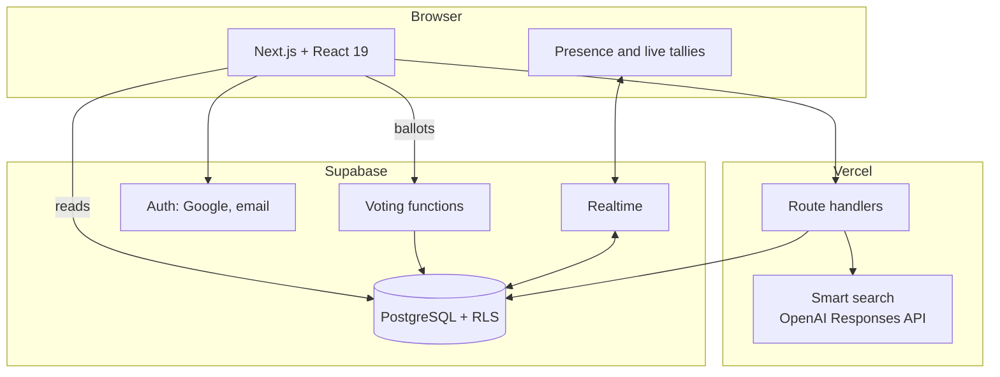

# Planind

A real-time group planning app for Dubai: the host sets constraints, the app shortlists venues, and the group votes through elimination rounds to a decision.

[Live app](https://plan-ind.vercel.app) · [Demo, no account required](https://plan-ind.vercel.app/demo)

https://github.com/user-attachments/assets/b4d43a6f-cfd2-4ab5-9c11-1d6dfedcd3f4

## Overview

Most planning tools help once a group has already decided. Planind targets the step before that, when a group chat has six suggestions and no decision. A host picks a budget, a travel radius and the kind of outing; the app deals nine venues from a curated Dubai catalogue, each with the reason it qualified, and participants vote live.

After a winner is chosen the plan continues into RSVPs, carpools, calendar invites, directions, weather and post-visit ratings.

## Highlights

- **Votes are enforced by the database.** Every ballot goes through a PostgreSQL function; concurrent duplicate votes resolve to a single row, verified by race-condition tests.
- **Search indexed for the slow case.** A trigram index cut venue searches that match nothing from 2.26 ms to 0.07 ms on a 5,082-venue benchmark dataset.
- **Hardened external fetching.** Importing a venue from a user-supplied URL is protected against SSRF, including DNS rebinding.
- **Measured under load.** 200 simultaneous voters completed in under 250 ms on a local stack, at about 0.5 ms of database time per vote.

## How it works

1. The host creates a plan with a budget, maximum drive and outing type.
2. Nine venues are dealt into three rounds of three, filtered by those constraints and opening hours in Dubai time.
3. Members open the shared link, sign in and vote. Each round produces a finalist, and a final round picks the winner.
4. Presence and tallies stream to every participant through Supabase Realtime.
5. The plan moves into coordination: attendance, drivers, calendar events, directions and weather.

<p align="center"></p>

## Architecture



The Next.js app reads plan data directly under row-level security and writes votes only through database functions. Route handlers on Vercel cover operations that need secrets or external services, such as AI search and venue import. Supabase Realtime carries presence and vote updates, so no separate WebSocket service is required.

## Engineering decisions

**Votes as database functions, not client writes.** A ballot must respect several rules at once: the round is open, the voter is a member, and they have not already voted. Encoding these in a PostgreSQL function makes them atomic under concurrency, at the cost of logic that lives outside the TypeScript codebase and needs its own database test suite.

**Mandatory sign-in for voting.** Guest voting was originally allowed to reduce friction. Testing showed a private browsing window could cast a second ballot, so voting now requires an account. One vote per account was judged more important than zero-friction entry.

**Realtime through the database provider.** Live tallies needed push updates without running a separate WebSocket service. Supabase Realtime kept the architecture to one backend, with the trade-off of tighter coupling to the provider.

**A trigram index for misses.** Venue search uses `ILIKE '%term%'`, which a B-tree cannot serve. The existing index was fast for common terms because the scan stopped early, but a typo or a missing venue scanned the whole table. A `pg_trgm` GIN index made misses 30 times faster while adding about 0.005 ms to common-term searches, which was accepted because misses are what users actually generate.

**Structured AI output behind a trust boundary.** Smart search maps free text to a search intent using the OpenAI Responses API with a JSON Schema output format. All logic after the model responds is pure, so hermetic tests can feed it hostile or malformed outputs without network access. A scored evaluation against the live model runs separately, on demand.

**SSRF protection for venue import.** Users can import a venue from a URL, which means the server fetches a host the user chose. The fetch primitive checks every resolved address against private and reserved ranges, then pins the connection to the checked address so a second DNS lookup cannot redirect it internally. Response bodies are capped across chunk boundaries.

## Tech stack

**Frontend:** Next.js 16, React 19, TypeScript, Tailwind CSS 4  
**Backend:** Supabase (PostgreSQL, Auth, Realtime), Next.js route handlers  
**AI:** OpenAI Responses API with structured outputs  
**Testing:** Node test runner, Playwright, custom load scripts  
**Infrastructure:** Vercel, GitHub Actions

## Testing

- **Unit (380+ tests):** dealing, tallying and ties, opening hours, parsing, AI guardrails and the SSRF guard.
- **Database (170+ tests):** run against real PostgreSQL, covering vote idempotency and races, membership, permissions and plan lifecycle.
- **Browser:** Playwright on desktop Chrome, Safari and Firefox, plus mobile Safari and Chrome.
- **AI evaluation:** a scored smart-search evaluation against the live model (`npm run eval:ai`).
- **Load:** vote bursts and Realtime fan-out in [`scripts/load/`](scripts/load).

CI runs linting, type checking, the database tests and a production build on every push.

## Performance

| Measurement | Before | After |
|---|---:|---:|
| Venue search, no match (5,082-venue dataset) | 2.256 ms | 0.074 ms |
| Venue search, rare term | 2.302 ms | 0.109 ms |
| 200 simultaneous voters, local stack | | under 250 ms, no errors |

Beyond 200 concurrent voters, the local API gateway ran out of connections before the database did; 1,000 votes sent directly to the database all succeeded. Benchmarks compare builds run side by side, after an early sequential comparison reported a 40% gain that was really server warm-up (the controlled figure was 8.5%). The index benchmark is recorded in [`migration-040`](supabase/migration-040-scale-indexes-and-rsvp-guard.sql).

## Getting started

Requires Node.js 22+ and a Supabase project (or the Supabase CLI with Docker).

```bash
npm ci
cp .env.local.example .env.local    # Supabase URL and publishable key
npm run dev
```

[`supabase/schema.sql`](supabase/schema.sql) rebuilds every table, so run it only against a disposable project. Test setup is in [`tests/README.md`](tests/README.md).

## Project structure

```
app/          Pages and route handlers
components/   UI components
lib/          Dealing, tallying, opening hours, AI intent, place import, search
supabase/     Schema and ordered migrations
tests/        Unit, database and end-to-end tests
scripts/      Load testing, AI evaluation, data backfill
docs/         Product flow, design standards, security, deployment
```

## Future work

- Server-side round deadlines, so rounds close on time without any participant online.
- Live opening hours and routing from Google Places in place of the curated data.
- Self-service account deletion from settings.

---

Built by [Aryan Sajiv](https://github.com/aryansajiv19).
