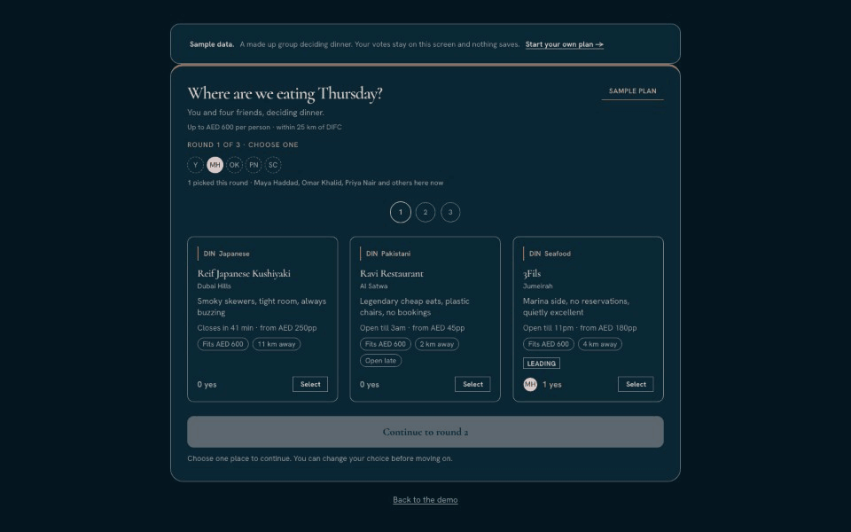
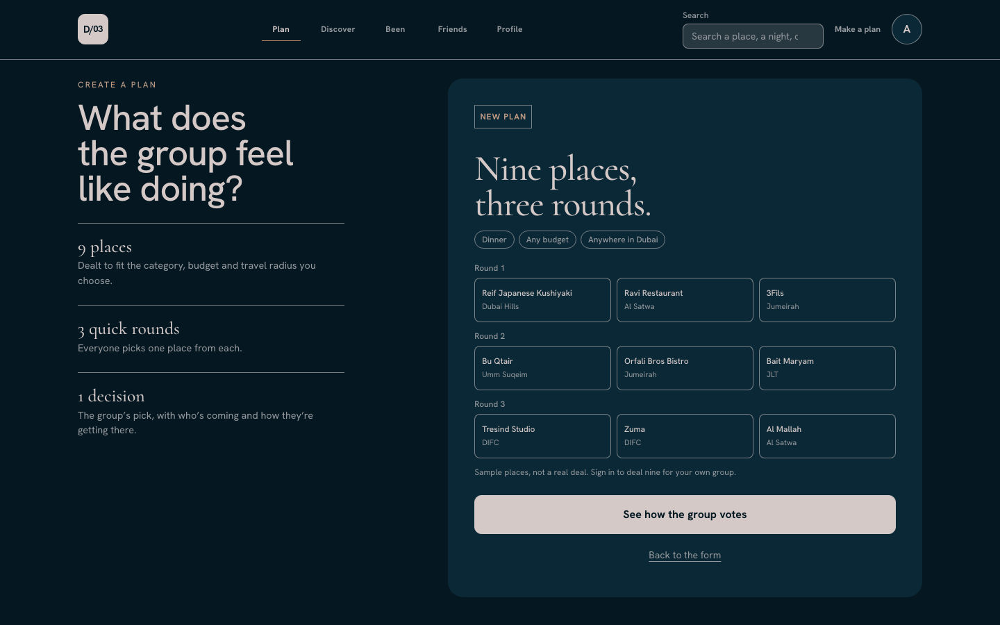
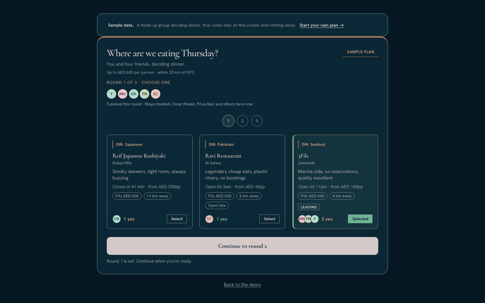
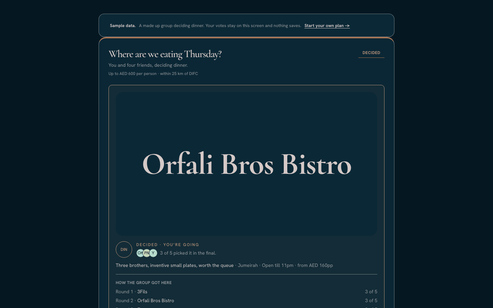
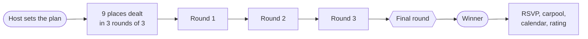
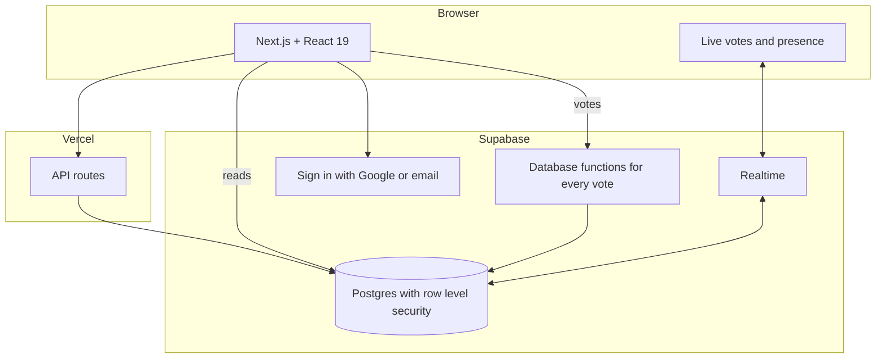

<div align="center">

# plan-ind

**Group plans in Dubai, decided in three rounds instead of three hundred messages.**

[Open the app](https://plan-ind.vercel.app) · [Try the demo, no account needed](https://plan-ind.vercel.app/demo)

[](https://github.com/aryansajiv19/plan-ind/actions/workflows/ci.yml)


</div>


<p align="center"><a href="https://raw.githubusercontent.com/aryansajiv19/plan-ind/main/docs/media/brag.mp4">Full quality with sound (mp4)</a></p>

## Why I built this

Anyone who has planned a night out in a group chat knows how it goes. Someone
says "we should do something", six places get suggested, three people never
reply, and nothing gets booked.

Most planning apps help once you already know the plan. I wanted something for
the part before that, when nobody has decided anything yet.

## How it works

1. One person starts a plan and picks a budget, how far everyone will drive,
   and the kind of night: dinner, brunch, desert, padel and so on.
2. The app deals nine places from a Dubai list I put together, and each card
   says why it made the cut.
3. Friends open the link and vote. Three rounds of three, one finalist from
   each, then a final round picks the winner.
4. After that the plan keeps going: who's coming, who's driving, calendar
   invites, directions, the weather that night, and a rating once you've been.

<p align="center"></p>

<table>
  <tr>
    <td></td>
    <td></td>
    <td></td>
  </tr>
  <tr>
    <td align="center">The deal</td>
    <td align="center">Voting live</td>
    <td align="center">The winner</td>
  </tr>
</table>



## The fun part: making it feel alive

I didn't want voting to feel like filling in a form. It should feel like
everyone is in the same room.

* When you vote, your face flies from the group onto the card you picked.
* The leading card slowly pulls ahead while the others drift back.
* Everything runs on Dubai time wherever you open it, so "closing soon" and the
  evening look of the app match the city, not your phone.
* Colour only ever means something: one colour per kind of night, gold only for
  the winner. I wrote the rules down in
  [`docs/FRONTEND_DESIGN_STANDARDS.md`](docs/FRONTEND_DESIGN_STANDARDS.md) so I
  would stop breaking them.

## Under the hood



A few decisions I'm proud of:

* **Nobody can fake a vote.** The browser never writes a vote directly. Every
  vote goes through a database function that checks the round is open, you're
  in the plan, and it's your only ballot. Two votes fired at the same instant
  still leave exactly one row.
* **A shared link doesn't leak the plan.** People can only read plans they've
  joined. The WhatsApp link preview gets a tiny read only summary and nothing
  else.
* **Everyone signs in.** I originally let guests vote without an account, then
  found you could open a private window and vote again. Now it's one account,
  one vote.
* **Search that actually scales.** At 5,000 places, a failed search went from
  2.26 ms to 0.07 ms after adding the right index. The same work caught a bug
  where results were silently capped at 1,000 rows.
* **I measured where it breaks.** On my laptop, 200 people voting at the same
  moment finished in under 250 ms with no errors. Past that, the local gateway
  ran out of connections, not the database: each vote costs about half a
  millisecond of database time, and 1,000 votes sent straight to the database
  all went through.

## Things I learned the hard way

* **Measure both versions at the same time.** My first benchmark said a change
  made things 40% faster. It was just the server warming up. Running both
  builds side by side gave the honest answer: 8.5%.
* **A notes file can lie.** My list of which database changes were live was
  wrong more than once, so now I check the database itself before trusting it.
* **One bad regex can take down a server.** Pasting a long link used to freeze
  the whole app. It now gives up in under 50 ms, and a test keeps it that way.

## Tests

| What | How | Run it |
|---|---|---|
| Logic | 250 unit tests for voting, ties, dealing and parsing | `npm test` |
| Database | Real Postgres: races, permissions, duplicate votes | `npm run test:db` |
| The whole app | 213 Playwright tests in desktop and mobile Chrome | `npm run test:e2e` |
| Load | Vote bursts and live update fan out | `scripts/load/` |

Every push runs lint, type checks, the database tests and a build in CI.

## Run it yourself

```bash
npm ci
cp .env.local.example .env.local   # your Supabase URL and public key
npm run dev
```

For a local database, run `supabase start` and load `supabase/schema.sql`. It
wipes and rebuilds every table, so only point it at a throwaway project. The
full setup for the database and browser tests is in
[`tests/README.md`](tests/README.md).

## Where things live

| Folder | What's in it |
|---|---|
| [`app/`](app) | Pages and API routes |
| [`components/`](components) | UI |
| [`lib/`](lib) | The logic: dealing, vote counting, opening hours, security, search |
| [`supabase/`](supabase) | Database schema and every change applied to it |
| [`tests/`](tests), [`scripts/`](scripts) | Tests and load testing |
| [`docs/`](docs) | Product flow, design rules, deployment |

**Built with** Next.js 16, React 19, TypeScript, Tailwind CSS 4, Supabase,
OpenAI and Vercel.

<div align="center">

Made by **Aryan Sajiv** · [GitHub](https://github.com/aryansajiv19)

</div>
